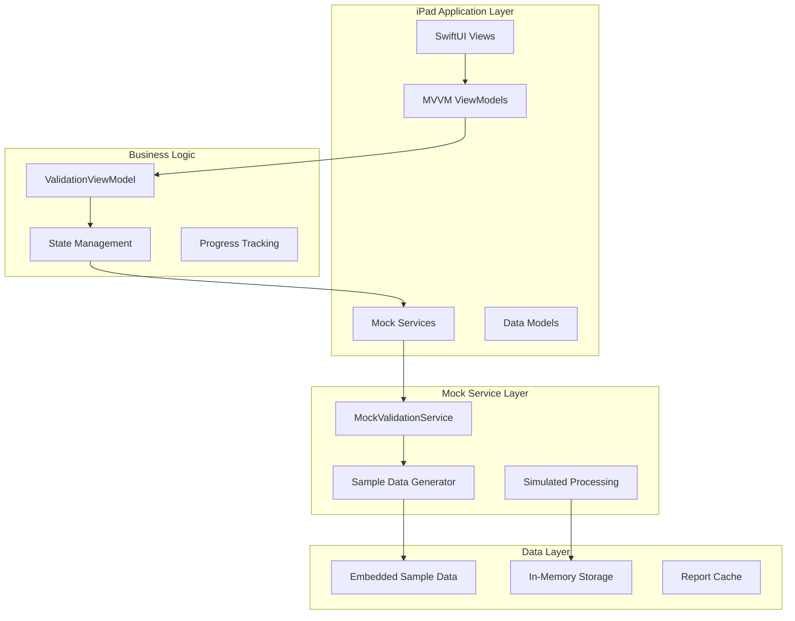

# Data Validation Dashboard - iOS Demo

# 📊🔍 Data Validation Dashboard


[](https://swift.org)
[](https://developer.apple.com/xcode/swiftui/)
[](https://www.apple.com/ios/)
[](https://www.python.org/downloads/)
[](https://fastapi.tiangolo.com/)

> **Pre-migration data validation tool for iOS** - Identify data quality issues, detect duplicates, and analyze inconsistencies before system migration. Built entirely for demo/teaching purposes with no backend required.

## 🎯 Overview

Data Validation Dashboard is a comprehensive iOS demonstration application designed to showcase pre-migration data validation capabilities. This proof-of-concept runs entirely on iPad with mock services, making it perfect for client demos, portfolio presentations, and teaching SwiftUI development. Built with cutting-edge iOS technologies and following Apple's Human Interface Guidelines, it provides a professional, enterprise-ready interface for data quality assessment.

### 🌟 Key Features

- **📈 Data Quality Scoring**: Multi-dimensional quality metrics with detailed breakdowns across Completeness, Accuracy, Consistency, and Uniqueness
- **🔄 Duplicate Detection**: Fuzzy matching algorithm with expandable record groups and field-level comparison
- **❌ Missing Field Analysis**: Impact assessment with High/Medium/Low categorization and affected record tracking
- **📱 iPad-Optimized UI**: Split view navigation, landscape layouts, and touch-optimized interactions
- **⚡ Real-time Processing**: Simulated upload and validation with progress tracking and status updates
- **🎨 Modern Design**: Professional SwiftUI interface with smooth animations and interactive visualizations
- **🎓 Educational Value**: Comprehensive teaching tool with step-by-step tutorials and well-documented code
- **🚀 Demo Ready**: No backend setup required - runs completely on-device with embedded sample data

## 🎬 Demo & Screenshots

### 📺 YouTube Demo

> **[Watch the Complete Demo on YouTube](https://youtube.com/your-demo-link)**

### 🖼️ Dashboard Screenshots

| Welcome Screen | Quality Score Dashboard |
|:--------------:|:----------------------:|
|  |  |

| Duplicate Detection | Missing Fields Analysis |
|:------------------:|:-----------------------:|
|  |  |

## 🚀 Quick Start

### Prerequisites

- **macOS 13.0+** (Ventura or later)
- **Xcode 15.0+** with iOS SDK
- **iPad Simulator** or physical iPad running iOS 16.0+
- **No backend required** - everything runs on device!

### 1. Clone the Repository

```bash
git clone https://github.com/yourusername/data-validation-dashboard-ios.git
cd data-validation-dashboard-ios
```

### 2. Open in Xcode

```bash
# Open the project
open DataValidationDashboard.xcodeproj

# Or use Xcode File > Open
```

### 3. Select Target Device

- Choose **iPad Pro 12.9"** simulator (recommended)
- Or any iPad device running iOS 16.0+
- Portrait and Landscape modes both supported

### 4. Build & Run

```bash
# Press Cmd + R in Xcode
# Or click the Run button in toolbar
```

### 5. Explore the Demo

- Tap **"Start Validation"** on welcome screen
- Select one of three sample datasets:
  - **Customer Data** (10,000 records) - Good quality with minor issues
  - **Product Catalog** (5,000 records) - Heavy duplicate detection
  - **Order History** (20,000 records) - Missing field analysis
- Watch simulated processing (2-3 seconds)
- Explore results in Overview, Duplicates, and Missing Fields tabs

## 🏗️ Architecture

### System Overview



### Tech Stack

#### Frontend (iOS)

- **SwiftUI**: Modern declarative UI framework
- **Swift 5.9+**: Type-safe, compiled language
- **Combine**: Reactive programming framework
- **Swift Charts**: Native data visualization (iOS 16+)
- **MVVM Pattern**: Model-View-ViewModel architecture

#### Mock Backend (On-Device)

- **In-Memory Processing**: All computation happens on iPad
- **Simulated Delays**: Realistic network latency simulation
- **Embedded Data**: JSON-based sample datasets
- **Async/Await**: Modern Swift concurrency

#### Analysis & Visualization

- **Core Graphics**: Custom chart rendering
- **SwiftUI Shapes**: Progress indicators and gauges
- **Color Coding**: Visual quality indicators
- **Interactive Charts**: Tap, expand, filter capabilities

#### No External Dependencies

- **Zero NPM Packages**: Pure SwiftUI implementation
- **No CocoaPods**: Uses Swift Package Manager only
- **No Backend**: Completely self-contained
- **Offline First**: Works without internet connection

## 📊 Data Validation Methodology

### Supported Quality Metrics

#### 1. Completeness Score

```swift
// Measures percentage of non-null fields
func calculateCompleteness(data: [Record]) -> Double {
    let totalFields = data.count * fieldCount
    let filledFields = data.flatMap { $0.values.filter { !$0.isEmpty } }.count
    return Double(filledFields) / Double(totalFields) * 100
}
```

#### 2. Accuracy Score

```swift
// Validates data formats and types
func calculateAccuracy(data: [Record]) -> Double {
    let validRecords = data.filter { record in
        validateEmailFormat(record.email) &&
        validatePhoneFormat(record.phone) &&
        validateDateFormat(record.date)
    }
    return Double(validRecords.count) / Double(data.count) * 100
}
```

#### 3. Consistency Score

```swift
// Checks data type uniformity
func calculateConsistency(data: [Record]) -> Double {
    let typeConsistent = checkFieldTypes(data)
    let formatConsistent = checkDateFormats(data)
    return (typeConsistent + formatConsistent) / 2 * 100
}
```

#### 4. Uniqueness Score

```swift
// Measures duplicate ratio using fuzzy matching
func calculateUniqueness(data: [Record]) -> Double {
    let duplicateGroups = findDuplicates(data, threshold: 0.85)
    let duplicateCount = duplicateGroups.flatMap { $0.records }.count
    return (1.0 - Double(duplicateCount) / Double(data.count)) * 100
}
```

### Duplicate Detection Algorithm

```swift
// Simplified fuzzy matching for demo
func findDuplicates(records: [Record], threshold: Double) -> [DuplicateGroup] {
    var groups: [DuplicateGroup] = []
    
    for i in 0..<records.count {
        for j in (i+1)..<records.count {
            let similarity = calculateSimilarity(records[i], records[j])
            
            if similarity >= threshold {
                let matchedFields = findMatchedFields(records[i], records[j])
                groups.append(DuplicateGroup(
                    records: [records[i], records[j]],
                    similarityScore: similarity,
                    matchedFields: matchedFields
                ))
            }
        }
    }
    
    return mergeDuplicateGroups(groups)
}
```

### Analysis Pipeline

```swift
// Complete validation workflow
class ValidationViewModel: ObservableObject {
    func processDataset(_ dataset: SampleDataset) async {
        // Step 1: Simulate file upload
        processingStatus = "Uploading..."
        let file = await mockService.uploadFile(dataset: dataset)
        
        // Step 2: Calculate quality scores
        processingStatus = "Analyzing quality..."
        let qualityScore = generateQualityScore(for: dataset)
        
        // Step 3: Detect duplicates
        processingStatus = "Detecting duplicates..."
        let duplicates = findDuplicates(in: dataset)
        
        // Step 4: Analyze missing fields
        processingStatus = "Analyzing missing fields..."
        let missingFields = analyzeMissingFields(in: dataset)
        
        // Step 5: Generate report
        let report = ValidationReport(
            qualityScore: qualityScore,
            duplicates: duplicates,
            missingFields: missingFields
        )
        
        // Step 6: Update UI
        reports.insert(report, at: 0)
        selectedReport = report
    }
}
```

## 📈 Sample Datasets

### Dataset 1: Customer Data (10,000 records)

**Quality Profile**: Good overall, minor cleanup needed

| Dimension | Score | Description |
|-----------|-------|-------------|
| Overall | 82.5% | Good data quality |
| Completeness | 88.0% | Missing phone numbers (850) |
| Accuracy | 85.0% | Invalid email formats (12%) |
| Consistency | 78.0% | Mixed date formats |
| Uniqueness | 79.0% | 3 duplicate groups found |

**Sample Record**:
```json
{
  "id": "1001",
  "name": "John Smith",
  "email": "john.smith@email.com",
  "phone": "555-0123",
  "address": "123 Main St",
  "city": "San Francisco",
  "state": "CA",
  "zip": "94102"
}
```

### Dataset 2: Product Catalog (5,000 records)

**Quality Profile**: Poor uniqueness (many duplicates)

| Dimension | Score | Description |
|-----------|-------|-------------|
| Overall | 68.0% | Fair data quality |
| Completeness | 92.0% | Missing descriptions (750) |
| Accuracy | 90.0% | Good format compliance |
| Consistency | 85.0% | Category variations |
| Uniqueness | 35.0% | **High duplicate rate!** |

**Duplicate Example**:
```json
[
  {"sku": "PROD-1001", "name": "Wireless Mouse", "price": "29.99"},
  {"sku": "PROD-2847", "name": "Wireless Mouse", "price": "29.99"},
  {"sku": "PROD-3921", "name": "Wireless Mouse - Black", "price": "29.99"}
]
```

### Dataset 3: Order History (20,000 records)

**Quality Profile**: Poor completeness (critical missing fields)

| Dimension | Score | Description |
|-----------|-------|-------------|
| Overall | 64.5% | Needs improvement |
| Completeness | 45.0% | **Many missing fields!** |
| Accuracy | 88.0% | Good format compliance |
| Consistency | 75.0% | Status code variations |
| Uniqueness | 90.0% | Few duplicates |

**Missing Fields**:
- `shipping_address`: 28% missing (5,600 records)
- `customer_email`: 21% missing (4,200 records)
- `payment_method`: 19% missing (3,800 records)
- `tracking_number`: 12% missing (2,400 records)

## 🎨 Dashboard Features

### Split View Navigation

- **Sidebar**: Recent validations list with quick stats
- **Detail Pane**: Full report with tabs and visualizations
- **Landscape Optimized**: Makes full use of iPad's large screen
- **Adaptive Layout**: Gracefully handles portrait orientation

### Interactive Visualizations

#### Quality Score Gauge

```swift
// Circular progress indicator
Circle()
    .trim(from: 0, to: score.overall / 100)
    .stroke(score.statusColor, lineWidth: 20)
    .frame(width: 120, height: 120)
    .rotationEffect(.degrees(-90))
    .animation(.easeInOut, value: score.overall)
```

#### Dimension Breakdown Cards

```swift
// 2x2 grid of quality dimensions
LazyVGrid(columns: [GridItem(.flexible()), GridItem(.flexible())]) {
    ForEach(dimensions) { dimension in
        DimensionCard(
            name: dimension.name,
            score: dimension.score,
            icon: dimension.icon,
            color: dimension.color
        )
    }
}
```

#### Duplicate Group View

- **Expandable Cards**: Tap to reveal full record details
- **Similarity Badge**: Color-coded percentage indicator
- **Matched Fields**: Highlighted in blue for easy comparison
- **Side-by-Side Layout**: Compare records visually

#### Missing Fields Chart

- **Impact Levels**: High (Red), Medium (Orange), Low (Yellow)
- **Progress Bars**: Visual percentage indicators
- **Affected Records**: Sample IDs for investigation
- **Sortable**: Order by impact or percentage

### Advanced Filtering (Future)

- Multi-dimensional attribute filtering
- Date range selection for historical analysis
- Threshold customization for bias sensitivity
- Minimum sample size requirements

## 📋 Code Documentation

### Project Structure

```
DataValidationDashboard/
├── App/
│   └── DataValidationDashboardApp.swift    # App entry point
│
├── Models/
│   ├── ValidationReport.swift              # Main report model
│   ├── QualityScore.swift                  # Quality metrics
│   ├── DuplicateGroup.swift                # Duplicate records
│   └── MissingFieldReport.swift            # Missing data
│
├── Views/
│   ├── ContentView.swift                   # Navigation structure
│   ├── SidebarView.swift                   # Report list
│   ├── DetailView.swift                    # Report display
│   ├── ValidationReportView.swift          # Main report view
│   ├── QualityScoreCard.swift              # Score visualization
│   ├── DuplicateGroupCard.swift            # Duplicate UI
│   ├── MissingFieldCard.swift              # Missing data UI
│   ├── DatasetPickerView.swift             # Sample selector
│   └── WelcomeView.swift                   # Empty state
│
├── ViewModels/
│   └── ValidationViewModel.swift           # Business logic
│
├── Services/
│   └── MockValidationService.swift         # Mock backend
│
├── Utilities/
│   ├── Extensions.swift                    # Swift extensions
│   └── Constants.swift                     # App constants
│
└── Resources/
    └── Assets.xcassets                     # Images & colors
```

### Key Classes Explained

#### ValidationViewModel.swift

```swift
@MainActor
class ValidationViewModel: ObservableObject {
    // Published properties trigger UI updates
    @Published var reports: [ValidationReport] = []
    @Published var selectedReport: ValidationReport?
    @Published var isProcessing = false
    @Published var processingProgress: Double = 0.0
    
    // Main processing function
    func processDataset(_ dataset: SampleDataset) async {
        // Orchestrates entire validation workflow
        // Updates @Published properties to refresh UI
    }
}
```

#### MockValidationService.swift

```swift
class MockValidationService {
    // Simulates file upload with delay
    func uploadFile(dataset: SampleDataset) async throws -> UploadedFile {
        try await Task.sleep(nanoseconds: 2_000_000_000) // 2 sec
        return UploadedFile(id: UUID(), recordCount: dataset.recordCount)
    }
    
    // Generates realistic validation results
    func validateData(file: UploadedFile) async throws -> ValidationReport {
        try await Task.sleep(nanoseconds: 3_000_000_000) // 3 sec
        return generateMockReport(for: file)
    }
}
```

## 🧪 Testing

### Running Tests

```bash
# Open Xcode
open DataValidationDashboard.xcodeproj

# Run tests: Cmd + U
# Or Product > Test in menu
```

### Test Coverage

- **ViewModels**: Business logic and state management
- **Mock Services**: Data generation and processing
- **UI Components**: SwiftUI view testing with previews
- **Integration**: End-to-end workflow testing

### Sample Test Case

```swift
@MainActor
class ValidationViewModelTests: XCTestCase {
    func testDatasetProcessing() async throws {
        // Arrange
        let viewModel = ValidationViewModel()
        XCTAssertTrue(viewModel.reports.isEmpty)
        
        // Act
        await viewModel.processDataset(.customers)
        
        // Assert
        XCTAssertEqual(viewModel.reports.count, 1)
        XCTAssertNotNil(viewModel.selectedReport)
        XCTAssertEqual(viewModel.selectedReport?.qualityScore.overall, 82.5)
    }
    
    func testQualityScoreCalculation() {
        // Test quality metric calculations
        let score = QualityScore(
            overall: 82.5,
            completeness: 88.0,
            accuracy: 85.0,
            consistency: 78.0,
            uniqueness: 79.0
        )
        
        XCTAssertEqual(score.statusText, "Good")
        XCTAssertEqual(score.statusColor, .green)
    }
}
```

## 📦 Deployment

### TestFlight Distribution

```bash
# 1. Archive the app
# Product > Archive in Xcode

# 2. Distribute to App Store Connect
# Upload to TestFlight for beta testing

# 3. Add external testers
# Share TestFlight link with stakeholders
```

### App Store Submission (Future)

```swift
// Update version info in Xcode
// MARKETING_VERSION = 1.0.0
// CURRENT_PROJECT_VERSION = 1

// Add required assets:
// - App Icon (1024x1024)
// - Screenshots (iPad Pro 12.9")
// - Privacy Policy URL
// - App Description
```

### Enterprise Distribution

```bash
# For internal company distribution
# Requires Apple Developer Enterprise Program

# 1. Create provisioning profile
# 2. Archive with enterprise certificate
# 3. Export as .ipa file
# 4. Distribute via MDM or direct download
```

## 🔧 Configuration

### Build Settings

```swift
// Minimum iOS version
IPHONEOS_DEPLOYMENT_TARGET = 16.0

// Supported devices
TARGETED_DEVICE_FAMILY = 2  // iPad only

// Swift version
SWIFT_VERSION = 5.9

// Optimization
SWIFT_OPTIMIZATION_LEVEL = -O  // Release
SWIFT_OPTIMIZATION_LEVEL = -Onone  // Debug
```

### Info.plist Configuration

```xml
<key>UILaunchScreen</key>
<dict/>
<key>UISupportedInterfaceOrientations~ipad</key>
<array>
    <string>UIInterfaceOrientationPortrait</string>
    <string>UIInterfaceOrientationLandscapeLeft</string>
    <string>UIInterfaceOrientationLandscapeRight</string>
</array>
```

## 🎓 Learning Path

### Level 1: Understanding the Demo (30 minutes)

**Goal**: Explore the app and understand its purpose

1. Run the app on iPad simulator
2. Try all three sample datasets
3. Explore each tab (Overview, Duplicates, Missing Fields)
4. Notice animations and transitions
5. Test portrait and landscape modes

**Key Takeaways**:
- How data validation works
- Quality metrics that matter
- UX patterns for data visualization

### Level 2: Architecture Deep Dive (1 hour)

**Goal**: Understand code structure and patterns

1. Study MVVM architecture
2. Review SwiftUI view composition
3. Understand mock service pattern
4. Examine state management with @Published
5. Learn async/await concurrency

**Key Files to Review**:
- `ValidationViewModel.swift` - Business logic
- `MockValidationService.swift` - Data simulation
- `ValidationReportView.swift` - UI composition

### Level 3: Code Walkthrough (2 hours)

**Goal**: Deep dive into implementation details

1. How file upload simulation works
2. Quality score calculation logic
3. Duplicate detection algorithm
4. SwiftUI view hierarchy
5. State management patterns

**Exercises**:
- Trace data flow from user tap to UI update
- Understand @StateObject vs @ObservedObject
- Learn view modifier patterns
- Study color and animation systems

### Level 4: Customization (2-4 hours)

**Goal**: Modify and extend the application

**Exercise 1**: Add new sample dataset
```swift
// Add "Employee Records" to SampleDataset enum
case employees = "Employee Records"
```

**Exercise 2**: Create custom quality dimension
```swift
// Add "Timeliness" metric
struct QualityScore {
    let timeliness: Double  // New dimension
}
```

**Exercise 3**: Build custom visualization
```swift
// Create trend chart for historical quality scores
struct QualityTrendChart: View { }
```

### Level 5: Production Ready (4-8 hours)

**Goal**: Convert to production application

**Phase 1**: Real backend integration
- Replace mock service with URLSession
- Implement multipart file upload
- Add authentication layer

**Phase 2**: Data persistence
- Add Core Data stack
- Cache reports locally
- Implement offline mode

**Phase 3**: Advanced features
- Real duplicate detection algorithm
- Statistical analysis integration
- PDF export functionality

## 🔍 Use Cases

### Educational Institutions

- **Course Materials**: Teach iOS development and SwiftUI
- **Student Projects**: Reference implementation for assignments
- **Research**: Study data validation methodologies
- **Demonstrations**: Show data quality concepts to non-technical stakeholders

### Consulting Firms

- **Client Demos**: Present data validation capabilities during discovery phase
- **Proof of Concept**: Validate approach before full implementation
- **Portfolio**: Showcase iOS development expertise
- **Training**: Onboard new team members on data quality practices

### Enterprise Applications

- **Internal Tools**: Template for building validation dashboards
- **Migration Projects**: Assess data quality before system transitions
- **Compliance**: Document data quality processes
- **Auditing**: Track data quality over time

## 📊 Performance & Scalability

### Current Demo Limits

- **In-Memory Storage**: Reports cached during app session
- **Embedded Data**: Three pre-built sample datasets
- **Single Device**: No cloud sync or multi-user support
- **iPad Only**: Optimized for iPad, not iPhone

### Production Considerations

**For Real-World Use**:
```swift
// Replace in-memory storage with Core Data
class PersistenceController {
    let container: NSPersistentContainer
    
    func saveReport(_ report: ValidationReport) {
        // Persist to local database
    }
}

// Add cloud sync with CloudKit
class SyncManager {
    func syncReports() async {
        // Sync with iCloud
    }
}

// Support larger datasets
func processLargeDataset(_ url: URL) async {
    // Stream processing for files >100MB
}
```

### Optimization Features

- **Lazy Loading**: Load views on-demand
- **Image Caching**: Cache generated charts
- **Background Processing**: Use Task.detached for heavy computation
- **Memory Management**: Clear old reports after threshold

## 🛡️ Security & Privacy

### Data Protection

- **On-Device Processing**: All data stays on iPad
- **No Network Calls**: Zero external API communication
- **Sandboxed Storage**: iOS app sandbox security
- **No Analytics**: No user tracking or data collection

### Privacy Compliance

- **FERPA Ready**: Educational records protection
- **GDPR Compatible**: No personal data transmission
- **Local Only**: No cloud storage or sharing
- **User Control**: Complete data ownership

### Production Security (Future)

```swift
// Add authentication
class AuthManager {
    func login(email: String, password: String) async throws {
        // Secure authentication flow
    }
}

// Encrypt sensitive data
func encryptData(_ data: Data) -> Data {
    // AES-256 encryption
}

// Implement biometric auth
func authenticateWithBiometrics() async throws -> Bool {
    // Face ID / Touch ID
}
```

## 🚨 Troubleshooting

### Common Issues

**Issue**: App crashes on launch
```bash
# Solution 1: Clean build folder
# Xcode: Product > Clean Build Folder (Cmd + Shift + K)

# Solution 2: Delete derived data
rm -rf ~/Library/Developer/Xcode/DerivedData

# Solution 3: Reset simulator
# Device > Erase All Content and Settings
```

**Issue**: Views not updating
```swift
// Ensure ViewModel uses @Published
@Published var reports: [ValidationReport] = []

// Ensure View observes ViewModel
@ObservedObject var viewModel: ValidationViewModel
```

**Issue**: Slow performance
```swift
// Use lazy loading
LazyVStack {  // Instead of VStack
    ForEach(items) { item in
        ItemView(item)
    }
}
```

**Issue**: Layout issues on iPad
```swift
// Test on correct simulator
// iPad Pro 12.9" (6th generation)
// Not iPhone simulators
```

### Debug Tips

```swift
// Add print statements
print("📊 Processing dataset: \(dataset.rawValue)")
print("✅ Report generated: \(report.id)")

// Use breakpoints in Xcode
// Click line number to add breakpoint

// View hierarchy debugging
// Debug > View Debugging > Capture View Hierarchy
```

## 🤝 Contributing

### How to Contribute

We welcome contributions from the community! This demo is designed to be a learning resource.

**Ways to Contribute**:
- 🐛 Report bugs or issues
- 💡 Suggest new features or improvements
- 📝 Improve documentation
- 🎨 Enhance UI/UX designs
- 🧪 Add test cases
- 🌍 Translate to other languages

### Development Setup

```bash
# 1. Fork the repository
# Click "Fork" on GitHub

# 2. Clone your fork
git clone https://github.com/YOUR_USERNAME/data-validation-dashboard-ios.git
cd data-validation-dashboard-ios

# 3. Create feature branch
git checkout -b feature/your-feature-name

# 4. Make changes and test
# Open in Xcode and run tests (Cmd + U)

# 5. Commit with clear message
git commit -m "Add: New quality dimension for timeliness"

# 6. Push to your fork
git push origin feature/your-feature-name

# 7. Create Pull Request
# Open PR on GitHub with description
```

### Code Standards

- **Swift Style**: Follow Swift API Design Guidelines
- **Comments**: Document complex logic and public APIs
- **Testing**: Add tests for new features
- **SwiftUI**: Use declarative patterns, avoid UIKit
- **MVVM**: Maintain separation of concerns

### Community Guidelines

- Be respectful and inclusive
- Focus on constructive feedback
- Help others learn and grow
- Share knowledge and resources
- Credit original authors

## 📄 License

**Proprietary Demo License**

Copyright (c) 2025 MonteyAI LLC. All rights reserved.

This project is released under a **proprietary demonstration license**. This is a proof-of-concept application intended for educational and demonstration purposes only.

### Quick Summary

✅ **Allowed**: Viewing, learning, educational use, portfolio demonstrations  
❌ **Not Allowed**: Commercial use, redistribution, production deployment  
⚠️ **No Warranties**: Provided "AS IS" for demonstration purposes only

### 📋 Full License Terms

**Please read the complete license agreement**: [LICENSE](LICENSE)

The full license includes important information about:
- Permitted uses and restrictions
- Disclaimer of warranties
- Limitation of liability
- Demo/proof-of-concept status
- Commercial licensing options

### 💼 Commercial Licensing

Interested in using this for production or commercial purposes?

📧 **Contact**: smontecinos@monteyai.com  
🌐 **Website**: https://monteyai.com  
🏢 **Company**: MonteyAI LLC

---

**By using this software, you agree to the terms in the [LICENSE](LICENSE) file.**

## 🙏 Acknowledgments

- **Apple SwiftUI Team**: For the powerful declarative UI framework
- **Swift Community**: For excellent resources and support
- **iOS Developer Community**: For continuous innovation
- **Open Source Contributors**: For inspiration and collaboration
- **Beta Testers**: For valuable feedback and testing

## 📈 Roadmap

### Q1 2025

- [x] Core validation engine with mock services
- [x] SwiftUI dashboard with split view
- [x] Three sample datasets with quality issues
- [x] Interactive duplicate detection

### Q2 2025

- [ ] Real file upload with document picker
- [ ] Core Data persistence layer
- [ ] PDF export functionality
- [ ] Advanced filtering and search

### Q3 2025

- [ ] Real backend API integration
- [ ] CloudKit sync for multi-device
- [ ] Advanced visualization types
- [ ] iPhone support with adaptive layout

### Q4 2025

- [ ] Machine learning-based duplicate detection
- [ ] Automated quality improvement suggestions
- [ ] Integration with Python FastAPI backend
- [ ] App Store release

---

<div align="center">

**Quick Links**

[Demo Video](https://youtube.com/demo) • [Documentation](docs/) • [Report Bug](https://github.com/yourusername/data-validation-dashboard-ios/issues) • [Request Feature](https://github.com/yourusername/data-validation-dashboard-ios/issues)

---

Made with ❤️ by MonteyAI LLC

**Perfect for**: Portfolio • Teaching • Client Demos • iOS Learning

</div>
